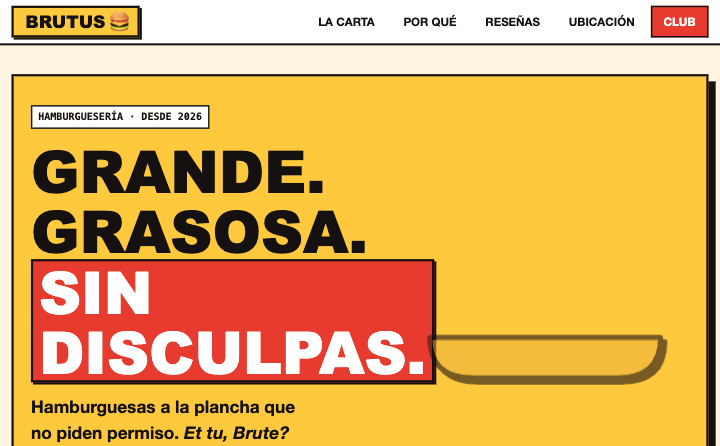
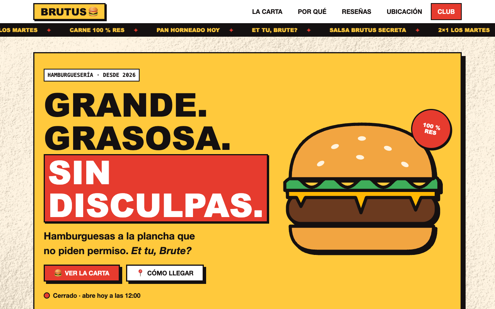
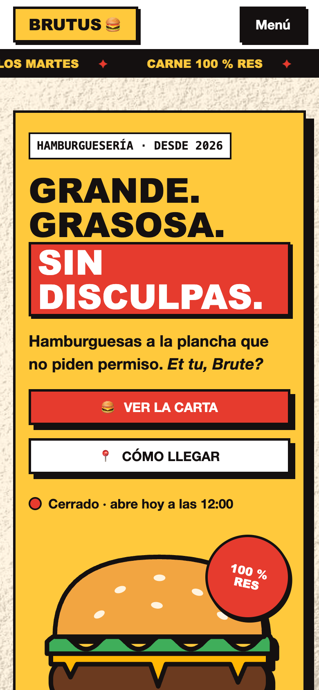

# Brutus Burgers 🍔

🌐 [English](README.md) · **Español**

[](https://github.com/zSamir015/brutus/actions/workflows/pages.yml)
[](https://github.com/zSamir015/brutus/actions/workflows/lighthouse.yml)
[](LICENSE)

**[Ver demo en vivo →](https://zsamir015.github.io/brutus/)**

Landing page neo-brutalista para una hamburguesería **ficticia** en Costa del Este, Panamá. Proyecto de portfolio: HTML, CSS y JavaScript vanilla en el frontend, y un backend opcional en Supabase para la suscripción al "Club Brutus".



## Qué demuestra este proyecto

- **Frontend sin frameworks**: HTML semántico, CSS con tokens de diseño y JavaScript en módulos, sin build.
- **Accesibilidad real**: navegación por teclado, ARIA, movimiento reducido y contraste verificado con Lighthouse.
- **Seguridad de punta a punta**: CSP estricta en el cliente; RLS, validación y rate limiting en el servidor.
- **Calidad automatizada**: tests unitarios, Lighthouse en CI y despliegue continuo a GitHub Pages.

| Escritorio | Móvil |
|---|---|
|  |  |

## Características

- **Diseño neo-brutalista**: bordes de 3 px, sombras sólidas sin desenfoque y una hamburguesa ilustrada en SVG que se arma capa por capa.
- **Carta filtrable** por categoría, con una ilustración propia en SVG por plato, la favorita destacada y etiquetas (picante, veggie).
- **Horario en vivo**: "Abierto ahora / Cerrado" calculado en la zona horaria del local, no en la del visitante.
- **Ubicación ilustrada**: fachada del local y mapa ficticio de Costa del Este (Av. Paseo del Mar, Corredor Sur, Bahía de Panamá).
- **Skeleton loaders** mientras carga el contenido, y aparición de secciones al hacer scroll.
- **Club Brutus**: formulario con validación, consentimiento explícito, honeypot anti-bots y throttle de UX.
- **Accesible**: skip link, ARIA, objetivos táctiles de 44 px o más, anuncios `aria-live` y `prefers-reduced-motion` respetado.
- **Seguro**: CSP estricta sin `unsafe-inline`, DOM construido solo con `textContent` y sin secretos en el frontend.
- **Detalles de UI animados**: cinta de anuncios, brillo que cruza los botones, iconos que giran, tarjetas que se elevan y se hunden, casilla con marca animada y grabados que se enderezan al pasar el mouse.
- **La leyenda**: grabados humorísticos de la Roma antigua de John Leech (c. 1850, dominio público) sobre fondo de papel.

## Stack

| Capa | Tecnología |
|---|---|
| Frontend | HTML, CSS (tokens de diseño), JavaScript ES modules, sin build ni dependencias |
| Backend (opcional) | Supabase: Postgres con RLS + Edge Function en Deno con Zod |
| Calidad | Tests con `node --test`, Lighthouse CI (accesibilidad ≥ 95) |
| Despliegue | GitHub Actions → GitHub Pages |

## Estructura

```
index.html
css/tokens.css          Único origen de diseño: colores, espaciado, tipografía, movimiento
css/styles.css          Estilos; solo consumen tokens
js/app.js               Menú, render del contenido, filtro, horario, formulario
js/art.js               Ilustraciones SVG de los platos (createElementNS, compatible con la CSP)
js/validate.js          Validación del formulario (pura, con tests)
js/hours.js             Cálculo de "abierto / cerrado" (puro, con tests)
js/config.js            Modo demo; el workflow lo sobrescribe al desplegar
data/content.json       Carta, reseñas, ubicación y horario
supabase/               Migraciones SQL y Edge Function `subscribe`
scripts/build.sh        Copia a _site/ solo lo que se publica
```

## Ejecutar en local

```bash
npm run dev      # python3 -m http.server 8000 (el fetch y los módulos no funcionan desde file://)
npm test         # tests de validación y horario
npm run build    # genera _site/ como en producción
```

## Decisiones técnicas

- **Sin frameworks ni build.** La página pesa pocos KB y carga sin pasos intermedios.
- **Contenido en JSON.** Cambiar la carta o el horario no requiere tocar HTML.
- **El horario usa la zona del local** (`America/Panama`, con `Intl.DateTimeFormat`), así un visitante en otro país ve el estado correcto.
- **El servidor nunca confía en el cliente.** La Edge Function revalida con Zod, exige consentimiento y aplica rate limiting en tres capas (global, por IP y por correo).
- **RLS sin políticas.** Las tablas son inaccesibles con la anon key; solo la Edge Function (service role) escribe.

Detalles y checklist en [SECURITY.md](SECURITY.md) (en inglés).

## Backend (opcional)

Sin backend, el formulario funciona en **modo demo**: valida, pero no guarda nada. Para activarlo:

```bash
supabase db push
supabase secrets set SERVICE_ROLE_KEY=... ALLOWED_ORIGINS=https://zsamir015.github.io
supabase functions deploy subscribe
```

Después añade `SUPABASE_FUNCTIONS_URL` y `SUPABASE_ANON_KEY` en GitHub → Settings → Secrets and variables → Actions. El workflow genera `js/config.js` con esos valores públicos al desplegar.

## Créditos

- Animaciones de UI adaptadas de [Uiverse.io](https://uiverse.io/) (autor: 0xnihilism, licencia MIT).
- Ilustraciones de John Leech, *The Comic History of Rome* (c. 1850), dominio público vía [Public Domain Image Archive](https://pdimagearchive.org/).
- Textura de papel derivada de [Texture Labs](https://texturelabs.org/).
- Inspiración de diseño: galerías de neo-brutalismo en [Dribbble](https://dribbble.com/search/neo-brutalism-food) (solo referencia; no se copió ningún diseño).

Detalles y licencias en [THIRD_PARTY_NOTICES.md](THIRD_PARTY_NOTICES.md) (en inglés).

## Licencia

El código es [MIT](LICENSE) © 2026 Samir Lorenzo. Los recursos de terceros conservan sus licencias (ver [THIRD_PARTY_NOTICES.md](THIRD_PARTY_NOTICES.md)); en particular, `assets/paper-grain.jpg` **no** está bajo MIT.

*Brutus Burgers es un negocio ficticio creado para este portfolio.*
